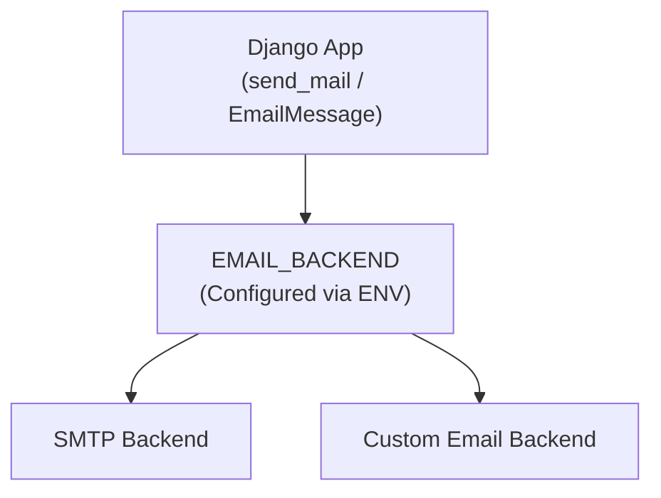

## Overview
This system supports **pluggable email backends** in Django, allowing dynamic switching between Email Backend:


## Backend Selection
- The email backend is controlled via environment variables:
- **SMTP Backend (Development)**
    ```env
    EMAIL_BACKEND=django.core.mail.backends.smtp.EmailBackend
    DEFAULT_FROM_EMAIL =<email>
    EMAIL_HOST=<host>
    EMAIL_PORT=<port>
    EMAIL_USE_TLS=False
    EMAIL_HOST_PASSWORD=<password>
    EMAIL_TO=<email>
    ````
- **Custom API Backend (Production)**
    ```env
    EMAIL_BACKEND=utils.email.base.ApiEmailBackend
    EMAIL_API_URL=<API_ENDPOINT>
    EMAIL_API_KEY=<API_KEY>
    DEFAULT_FROM_EMAIL=<email>
    EMAIL_TO=<email>
    ```

## High-Level Architecture


## Custom Email Backend Components

- Base Email Backend (`EmailBackend`)
    - An abstract class extending Django’s `BaseEmailBackend`.
    - Manage HTTP session lifecycle (`open`, `close`)
    - Ensure thread safety using `threading.RLock`
    - Provide reusable utilities (e.g., Base64 encoding)

- Custom Email Backend (`ApiEmailBackend`)
    - Implementation of `EmailBackend` for a specific external email API.
    - Transform `EmailMessage` into API-compatible payload
    - Encode email fields using Base64
    - Support HTML and plain text email content
    - Handle API responses (success/failure)

**Key Methods**

| Method              | Description                            |
| ------------------- | -------------------------------------- |
| `open()`            | Initializes HTTP session               |
| `close()`           | Closes HTTP session                    |
| `send_messages()`   | Sends batch of email messages          |
| `_send_message()`   | Sends a single email                   |
| `_build_headers()`  | Constructs HTTP headers                |
| `_build_payload()`  | Abstract method for payload generation |
| `_handle_success()` | Handles successful response            |
| `_handle_failure()` | Handles failed response                |

## Request Flow
1. Django constructs an `EmailMessage`
2. `send_messages()` is invoked by the backend
3. A thread-safe session is initialized
4. For each message:
   - `_build_headers()` prepares HTTP headers
   - `_build_payload()` converts message to API format
   - HTTP POST request is sent to the API endpoint
5. Response handling:
   - Success → logged and counted
   - Failure → logged and optionally raises exception

## Header Construction
Default headers
```json
{
    "Content-Type": "application/json"
}
```
> Note: The current API does not support passing the API key via request headers Therefore, the API key is appended as a query parameter in the endpoint URL instead.

## Payload Format
The email message is converted into a JSON payload:

```json
{
  "FromAsBase64": "<encoded>",
  "ToAsBase64": "<encoded>",
  "CcAsBase64": "<encoded>",
  "BccAsBase64": "<encoded>",
  "SubjectAsBase64": "<encoded>",
  "BodyAsBase64": "<encoded>",
  "IsBodyHtml": true
}
```

## Thread Safety
- A `threading.RLock` is used to ensure safe concurrent access
- Prevents race conditions when multiple threads send emails
- Ensures session reuse without corruption
